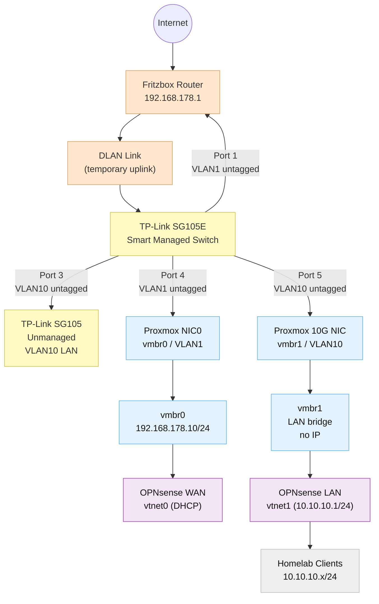

# 04 — Network Architecture

## 4.1 High-Level Design Diagram

```mermaid
graph TD
    %% ===== Classes / Colors =====
    classDef router fill:#ffe6cc,stroke:#e0a46b,stroke-width:1px,color:#333;
    classDef switch fill:#fff9c4,stroke:#d4c34f,stroke-width:1px,color:#333;
    classDef server fill:#e3f2fd,stroke:#64b5f6,stroke-width:1px,color:#111;
    classDef fw fill:#f3e5f5,stroke:#ab47bc,stroke-width:1px,color:#111;
    classDef client fill:#eeeeee,stroke:#bdbdbd,stroke-width:1px,color:#111;

    %% ===== Nodes =====
    Internet((Internet))

    Fritzbox["Fritzbox Router<br>192.168.178.1"]
    DLAN["DLAN Link<br>(temporary uplink)"]

    SG105E["TP-Link SG105E<br>Smart Managed Switch"]
    SG105["TP-Link SG105<br>Unmanaged<br>VLAN10 LAN"]

    ProxmoxNIC0["Proxmox NIC0<br>vmbr0 / VLAN1"]
    Proxmox10G["Proxmox 10G NIC<br>vmbr1 / VLAN10"]

    OPN_WAN["OPNsense WAN<br>vtnet0 (DHCP)"]
    OPN_LAN["OPNsense LAN<br>vtnet1 (10.10.10.1/24)"]

    HomelabClients["Homelab Clients<br>10.10.10.x/24"]

    %% ===== Connections =====
    Internet --> Fritzbox
    Fritzbox --> DLAN
    DLAN --> SG105E

    SG105E -->|"Port 4<br>VLAN1 untagged"| ProxmoxNIC0
    SG105E -->|"Port 5<br>VLAN10 untagged"| Proxmox10G
    SG105E -->|"Port 3<br>VLAN10 untagged"| SG105
    SG105E -->|"Port 1<br>VLAN1 untagged"| Fritzbox

    ProxmoxNIC0 --> vmbr0["vmbr0<br>192.168.178.10/24"]
    Proxmox10G --> vmbr1["vmbr1<br>LAN bridge<br>no IP"]

    vmbr0 --> OPN_WAN
    vmbr1 --> OPN_LAN

    OPN_LAN --> HomelabClients

    %% ===== Class assignments =====
    class Fritzbox,DLAN router;
    class SG105E,SG105 switch;
    class ProxmoxNIC0,Proxmox10G,vmbr0,vmbr1 server;
    class OPN_WAN,OPN_LAN fw;
    class HomelabClients client;
```
<!-- pagebreak -->