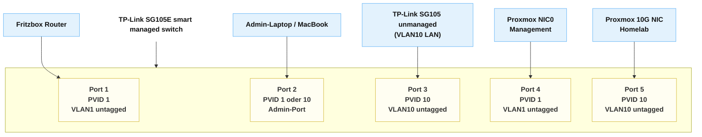

# 05 - Switch and VLAN Configuration

## 5.1 VLAN Plan
| VLAN                      | ID | Purpose                                                    |
| ------------------------- | -- | ---------------------------------------------------------- |
| **Default LAN**           | 1  | Home network from Fritzbox (management + WAN for OPNsense) |
| **Homelab / Pentest LAN** | 10 | OPNsense LAN + isolated virtual network                    |

## 5.2 SG105E VLAN Implementation
Untagged VLANs on Physical Ports

SG105E does not support hybrid tagging per enterprise-grade standards; instead it uses PVID-based untagging.
| Port | PVID    | VLAN Membership | Mode                      |
| ---- | ------- | --------------- | ------------------------- |
| 1    | 1       | VLAN1 untagged  | WAN uplink                |
| 2    | 1 or 10 | admin access    | variable                  |
| 3    | 10      | VLAN10 untagged | uplink to unmanaged SG105 |
| 4    | 1       | VLAN1 untagged  | Proxmox management        |
| 5    | 10      | VLAN10 untagged | Proxmox 10G NIC           |

## 5.3 Port Plan

<!-- pagebreak -->