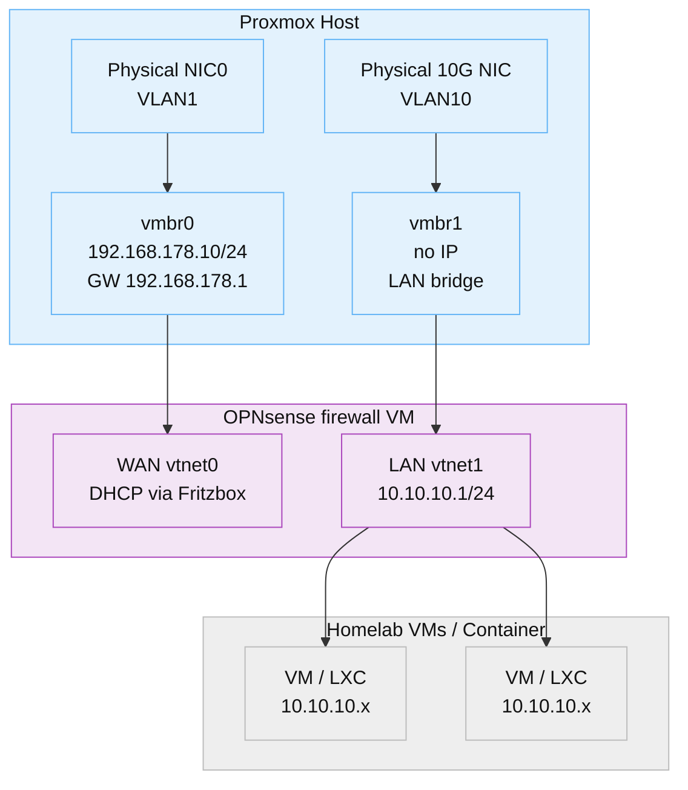

# 06 - Proxmox Configuration

## 6.1 Network Interfaces Configuration
```
auto lo
iface lo inet loopback

// Management NIC
auto nic0
iface nic0 inet manual

// LAN NIC for OPNsense
auto enp10s0
iface enp10s0 inet manual

// vmbr0 -- Management + OPNsense WAN
auto vmbr0
iface vmbr0 inet static
    address 192.168.178.10/24
    gateway 192.168.178.1
    bridge-ports nic0
    bridge-stp off
    bridge-fd 0

// vmbr1 -- OPNsense LAN (no IP on host!)
auto vmbr1
iface vmbr1 inet manual
    bridge-ports enp10s0
    bridge-stp off
    bridge-fd 0
```
### 6.2 Proxmox Network Diagram


## 6.3 Key Rules
- vmbr0 must NEVER lose its static IP (fail-safe management)
- vmbr1 must NEVER have an IP (isolated, routed by OPNsense)
- OPNsense interacts only with the vtnet virtual interfaces
- VLANs are handled physically by switch, not by Proxmox
<!-- pagebreak -->