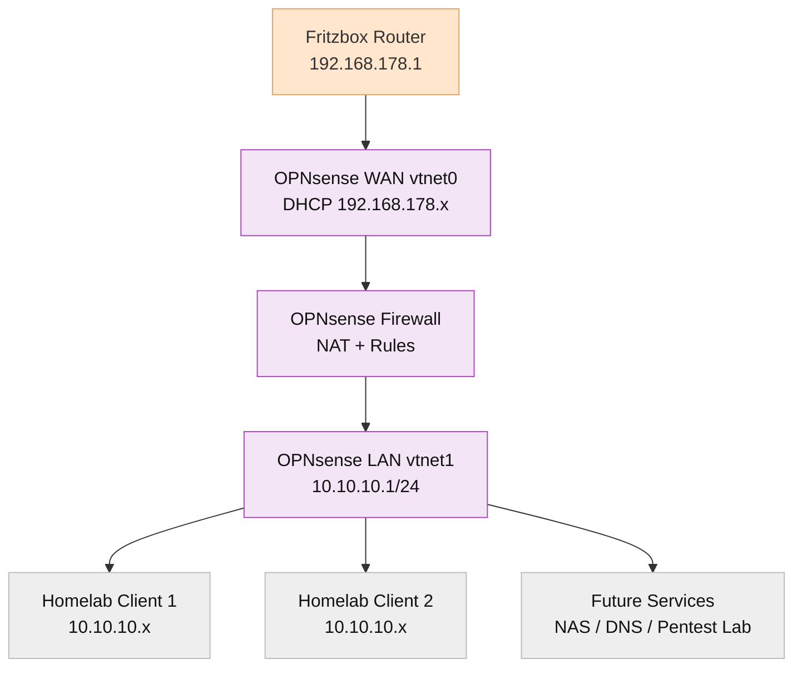

# 07 - OPNsense Configuration

## 7.1 Interface Assignment
| vtnet      | Purpose | Connected to                 |
| ---------- | ------- | ---------------------------- |
| **vtnet0** | WAN     | vmbr0 (DHCP via Fritzbox)    |
| **vtnet1** | LAN     | vmbr1 (static 10.10.10.1/24) |

## 7.2 Initial Console Setup (Critical Steps)
##### WAN (vtnet0)
 - Configure IPv4: YES
 - Mode: DHCP
 - No static IPs
 - No IPv6
 - No gateway manually set

##### LAN (vtnet1)
 - Configure IPv4: YES
 - IP: 10.10.10.1
 - Subnet: /24
 - Enable DHCP server: YES
 - Range: 10.10.10.100 – 10.10.10.200
 - Enable HTTPS: YES
 - Generate self-signed certificate: YES

## 7.3 Overview

<!-- pagebreak -->