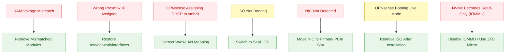

# 09 – Issues and Solutions

This chapter documents all issues encountered during the Homelab deployment, including their symptoms, root causes, diagnostic methods, and confirmed solutions.  
The purpose of this section is to make future recovery easier, to prevent recurring errors, and to maintain a technical knowledge base for the system.

---

## 9.1 Issue: RAM Voltage Mismatch Causing Boot Loop

**Symptoms:**  
- System powers on → immediately shuts off → loops  
- No POST  
- No video output  

**Root Cause:**  
Mixed voltage RAM modules (1.2V + 1.35V) caused unstable memory training.

**Diagnostics:**  
- Removing modules one by one  
- Identifying that both 1.2V and 1.35V modules boot successfully, but not in combination (pairs only)  

**Solution:**  
- Remove mismatched high-voltage modules  
- Use identical JEDEC-compatible sticks only  
- System boots consistently afterward

---

## 9.2 Issue: Proxmox Unreachable (Wrong Static IP Assigned)

**Symptoms:**  
- No Web UI  
- No SSH  
- Ping fails  
- Server disappears from LAN  

**Root Cause:**  
Management bridge `vmbr0` was accidentally assigned **10.10.10.1**, an internal LAN address used by OPNsense.  
This moved Proxmox into the firewall LAN, isolating it from the main network.

**Diagnostics:**  
- Checked switch: port active  
- No ARP entry  
- No DHCP lease → static misconfig  
- Required local console to repair  

**Solution:**  
- Install GPU temporarily  
- Boot into shell  
- Restore `/etc/network/interfaces`  
- Reassign correct management IP (e.g. 192.168.178.10/24)

---

## 9.3 Issue: OPNsense Assigning IP to Proxmox `vmbr0`

**Symptoms:**  
- Proxmox suddenly receives an IP from OPNsense  
- Routing conflicts  
- GUI becomes unreachable  

**Root Cause:**  
WAN/LAN interfaces inside OPNsense were reversed:  
- vtnet0 (WAN) was configured as LAN  
- vtnet1 (LAN) was configured as WAN  

This caused OPNsense to treat vmbr0 as a LAN client and assign DHCP to it.

**Solution:**  
- Reassign interfaces inside OPNsense console  
- Correct mapping:  
  - **vtnet0 → WAN (DHCP)**  
  - **vtnet1 → LAN (10.10.10.1/24)**  
- Reboot firewall  
- Connectivity restored

---

## 9.4 Issue: ISO Not Booting Inside Proxmox VM

**Symptoms:**  
- VM shows “No bootable device”  
- OPNsense/other ISOs ignored  

**Root Cause:**  
Legacy BIOS mode selected → incompatible with OPNsense image.

**Solution:**  
- Change VM firmware to **SeaBIOS**  
- Boot works immediately  

---

## 9.5 Issue: 10G NIC Not Detected

**Symptoms:**  
- Proxmox shows only one network adapter  
- `ip a` returns no 10G interface  
- No link LEDs on NIC  

**Root Cause:**  
The XG-C100C card needs a **full x16 or x4 electrical slot**.  
Original slot was chipset-disabled for large PCIe devices.

**Diagnostics:**  
- Move card between slots  
- Find slot electrically wired to CPU  

**Solution:**  
- Move GPU to secondary slot  
- Install NIC in primary x16 slot  
- NIC detected as `enp10s0` after reboot

---

## 9.6 Issue: OPNsense Boot Loop Into Live Mode

**Symptoms:**  
- After installation OPNsense keeps showing the installer  
- Settings gone after reboot  
- LAN IP resets each time  

**Root Cause:**  
The ISO was **not removed** after installation.  
VM rebooted into Live Mode instead of the installed system.

**Solution:**  
- Remove ISO from VM hardware → CD/DVD drive  
- Reboot → boots from virtual disk normally

---

## 9.7 Issue: Proxmox Root Filesystem Becomes Read-Only After Enabling IOMMU

**Symptoms:**
- System boots → root filesystem becomes read-only after ~3–10 seconds  
- Docker/LXC/TrueNAS VMs fail  
- Logs show:
`EXT4-fs (dm-1): failed to convert unwritten extents …`
`EXT4-fs error: aborted journal`
`EXT4-fs: Remounting filesystem read-only`

- Web UI unreachable  
- SSH read-only  

**Root Cause:**  
The NVMe used for Proxmox installation is a **DRAM-less SSD**.  
When enabling **IOMMU**, queue depth and latency increase →  
NVMe firmware triggers **protection mode**, making the drive read-only.

This is a known problem with DRAM-less NVMe in virtualization environments.

**Failed Solutions Attempted:**  
- Proxmox Recovery Mode → no fix  
- Boot into single-user mode via GRUB:  
`init=/bin/bash`
- Running filesystem repair:
`fsck -yf /dev/mapper/pve-root` or `fsck -yf /dev/pve/root `
- All fsck phases successful → **BUT issue returns after reboot**  
→ because the problem is firmware-level, not filesystem-level.

**Working Solution:**  
- **Disable IOMMU** in BIOS  
- Avoid passthrough for the DRAM-less NVMe  
- Use WD Red HDDs as a **ZFS mirror**  
- Keep NVMe only as simple Proxmox boot disk  
- (Optional) Replace with a proper NVMe with DRAM

---

## 9.8 Issue Flow Summary Diagram

A complete overview of all discovered issues:

<!-- pagebreak -->