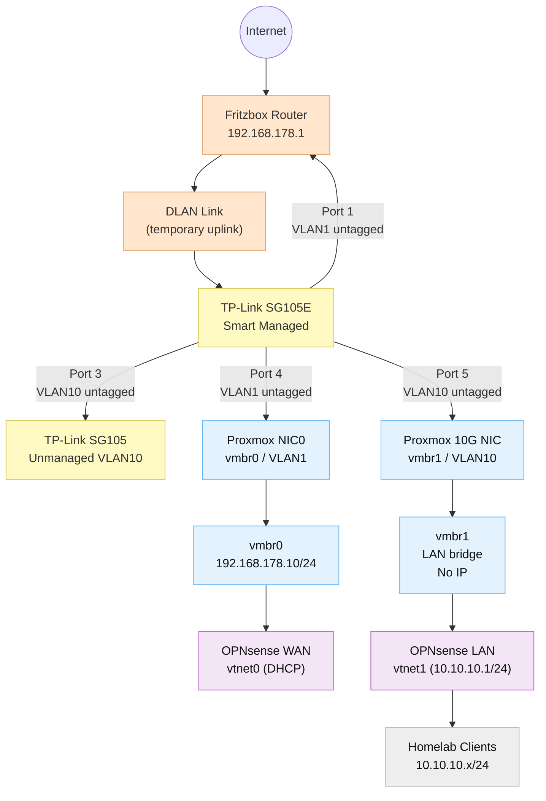
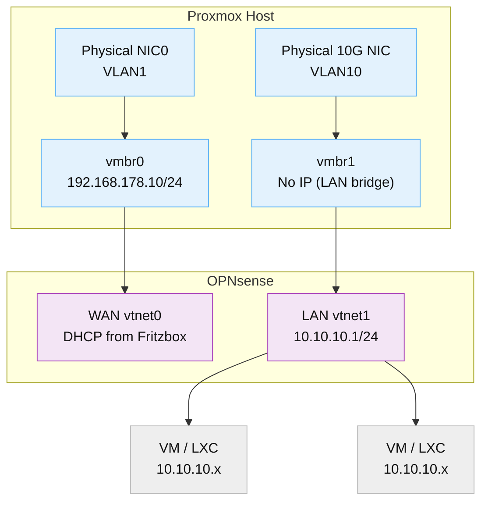
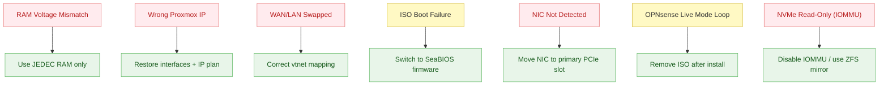

# Appendix – Diagrams

This appendix contains all architectural and troubleshooting diagrams used throughout the documentation.  
They are consolidated here for quick reference and print-friendly output.

---

## A.1 High-Level Network Architecture

---

## A.2 Proxmox Virtual Network Layout

---

## A.3 Issue Overview Diagram

<!-- pagebreak -->
